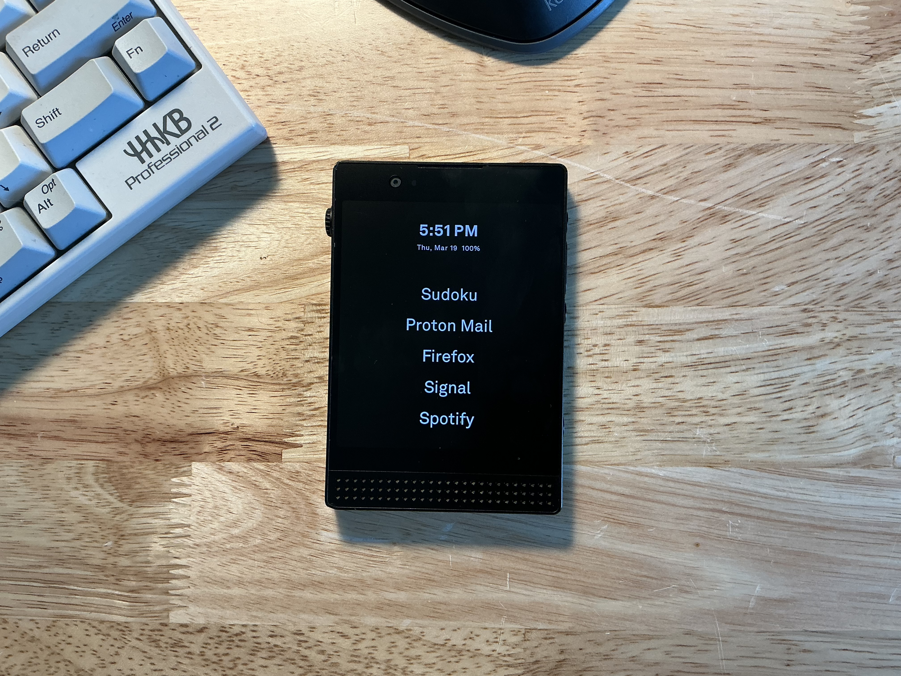
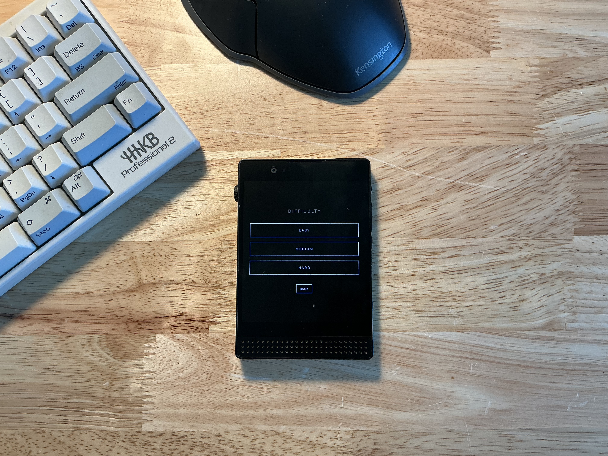
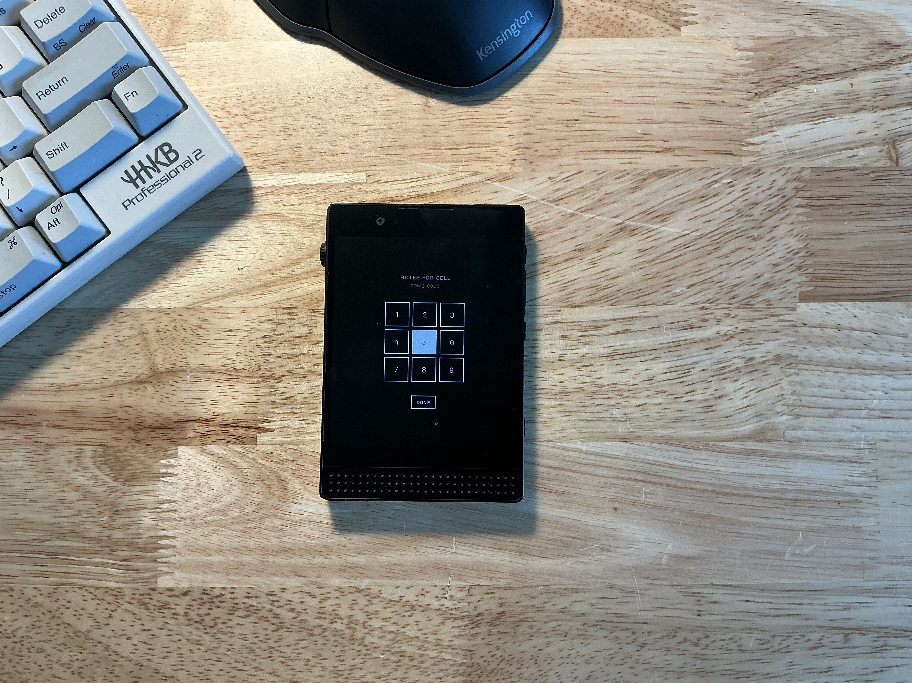
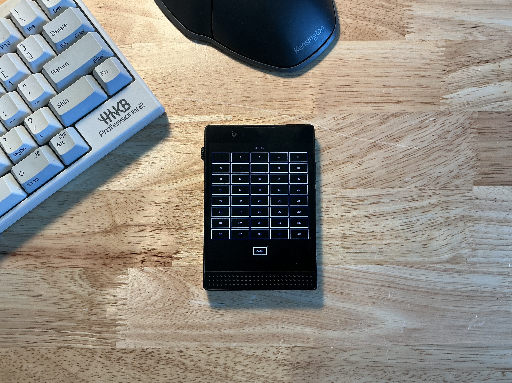
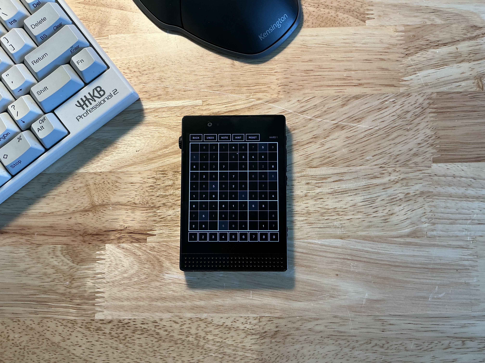

# Sudoku for Light Phone III

A minimal Sudoku app designed for the Light Phone III. Black and white interface that matches the LightOS aesthetic.

## Pictures

<table>
  <tr>
    <td></td>
    <td></td>
  </tr>
  <tr>
    <td></td>
    <td></td>
  </tr>
  <tr>
    <td colspan="2"></td>
  </tr>
</table>

## Features

- 120 puzzles across three difficulties
- Notes mode, hints, undo, conflict highlighting
- Progress saves automatically

## Tech Stack

- Kotlin
- Jetpack Compose
- SharedPreferences for persistence
- JUnit for testing

## Architecture

Layered architecture separating concerns:

```
model/       Pure data classes and enums (GameState, Difficulty, Screen)
data/        Platform-dependent I/O (PuzzleRepository, GameStorage)
domain/      Pure business logic (SudokuSolver)
ui/          Compose UI and state management (ViewModel, screens, components)
```

**State Management**

Single `SudokuViewModel` holds all app state using Compose's `mutableStateOf`. Screen navigation, game state, and user selections all live here. State updates are immutable - every change creates a new `GameState` copy rather than mutating in place.

**Persistence Layer**

`GameStorage` wraps SharedPreferences with three separate preference files: one for in-progress games, one for completed levels, and one for notes. This keeps the data organized and makes it easy to query things like "which levels are complete" without parsing unrelated data.

**Solver**

Backtracking algorithm in `SudokuSolver`. Recursively tries values 1-9 in empty cells, backtracks when it hits a dead end. Also handles validation and conflict detection for the UI. Runs on the main thread since real puzzles solve instantly, but would need to move to a coroutine if used for generation.

**Compose Patterns**

- Stateless composables that receive data and callbacks from the ViewModel
- Conditional animations using `rememberInfiniteTransition` only when active (no wasted recompositions)
- Custom `Modifier.drawWithContent` for drawing cell borders without nested layouts

## Testing

Unit tests cover the solver's validation and conflict detection. Tests avoid calling the actual solve function since backtracking is slow on sparse boards. Puzzle file format is validated separately.

```bash
./gradlew test
```
